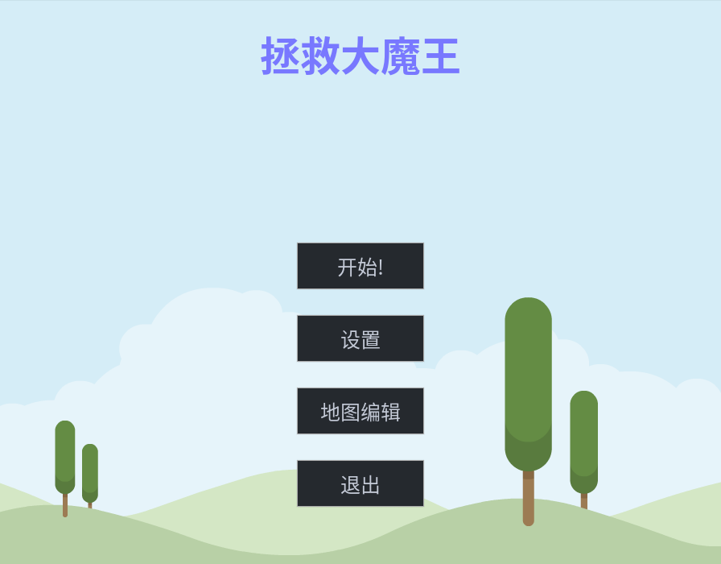

# Feed the Dragon

一个简单的小游戏，和 [fengzhunsheng](https://github.com/fengzhunsheng) 合作开发。
这是我们的软件工程的作业，基于 [pygame 2](https://github.com/pygame/pygame) 和自己修改后的 [pygame_gui](https://github.com/MyreMylar/pygame_gui) 开发。

## 游戏截图
开始界面：

游戏界面:

地图编辑器界面：

